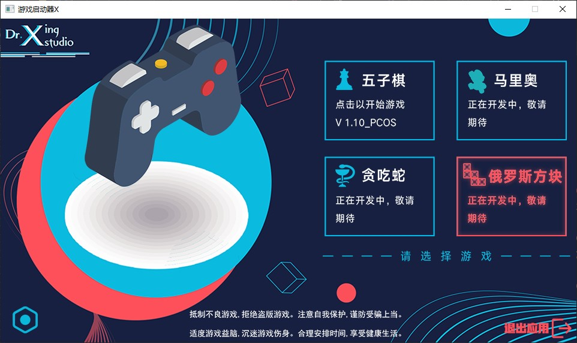
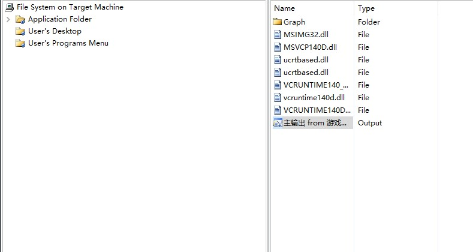
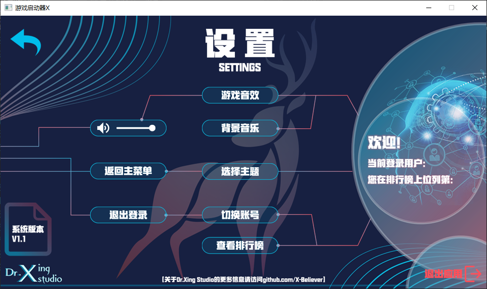
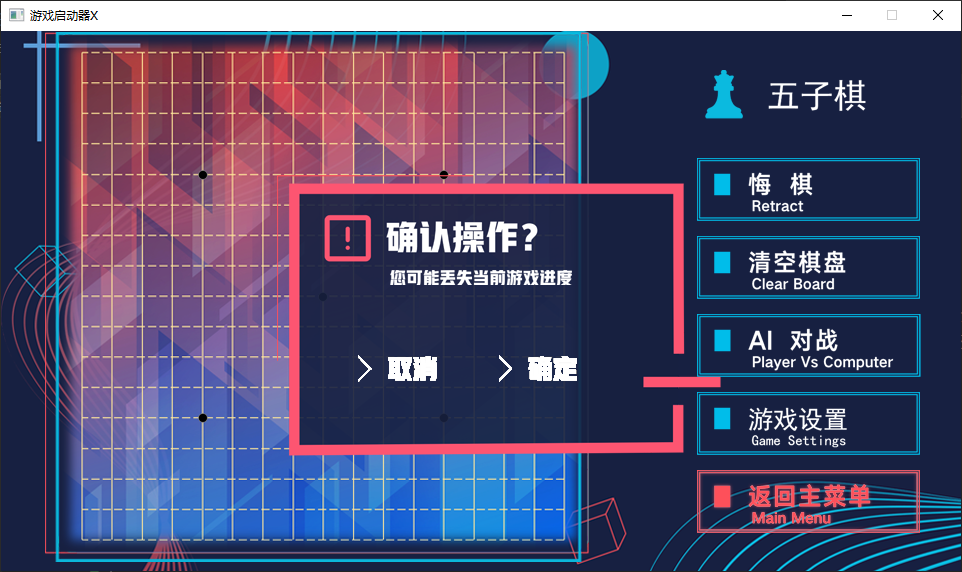
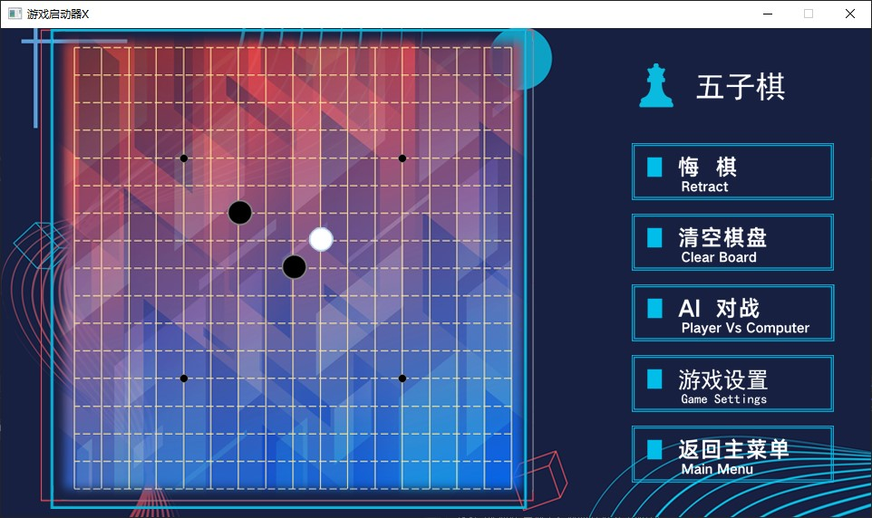

# 游戏启动器-X

By X-Believer

游戏启动器-X是由"Dr. Xing Studio"开发的一款小游戏合集应用。应用基于C++面向对象编程，使用继承和多态实现各种功能的管理，并使用EazyX图形库实现图形界面设计。

作者X-Believer是蒟蒻的新人程序员，闲着没事想做一个C++作品，于是在大一下学期开了这个坑，说不定以后可以当作C++大作业。

## 主程序更新日志

### V1.0 

#### 2023-03-18

1.创建了项目"游戏启动器X.sln"

2.创建类"SystemManager"来管理主程序的功能

3.在Photoshop绘制主界面和按钮

4.实现"SystemManager"中函数"ShowMenu"显示主菜单功能

5.创建main函数

6.引用了类"Transparent"实现png图像的透明化输出

------

#### 2023-03-19

1.创建父类"Games"用多态方式管理各个小游戏

2.创建类"Games"中纯虚函数"ShowGameMenu"显示游戏菜单

3.创建类"Games"中纯虚函数"RunGame"启动游戏

4.优化了"SystemManager"中的各个函数

------

#### 2023-03-22

1.实现"SystemManager"中函数"UserDO"用户交互功能

2.为主界面上按钮添加交互效果

3.解决与主界面交互时显示错误的Bug

4.在main函数创建接口，调用五子棋，完成V1.0的全部代码编写

5.创建项目"X-游戏启动器"实现V 1.0的打包输出

------

### V1.1

#### 2023-03-27

1.完善"SystemManager"中函数"ShowMenu"显示主菜单功能

2.添加主菜单背景音乐和交互音效

3.实现"SystemManager"中函数"Exit"退出应用功能

------

#### 2023-03-29

1.在Photoshop中绘制了设置界面

2.实现暂停背景音乐功能

------

#### 2023-04-01

1.实现"SystemManager"中函数"SettingMenu"设置菜单功能

2.优化用户交互的代码实现

3.将五子棋接入设置界面

------

#### 2023-04-03

1.实现"SystemManager"中函数"MSGWindow"信息窗口功能

2.将"MSGWindow"接入一些函数操作，实现提示窗口功能

------

#### 2023-04-07

1.在Photoshop中绘制AccountMenu账号界面

2.实现账号界面的打印

------

#### 2023-04-09

1.实现"SystemManager"中函数"AccountMenu"账户菜单所有功能

2.实现"SystemManager"中函数"SystemLogin"登录验证功能

3.实现"SystemManager"中函数"ShowInfo"显示信息功能

4.实现"SystemManager"中函数"DeleteAccount"删除账号功能

5.解决账户菜单中显示错误的Bug

6.实现管理员管理账号功能

7.账号系统基本完善

8.完成V1.1版本的所有代码编写

9.实现V1.1版本的打包输出

------

## 五子棋更新日志

### V1.0

#### 2023-03-17

1.创建类"FiveChess"来管理小游戏五子棋相关功能

2.在Photoshop中绘制棋盘

3.实现"FiveChess"中函数"putboard"显示界面功能

4.继承"Games"类，重写纯虚函数"RunGame"

------

#### 2023-03-18

1.修改五子棋游戏界面

2.实现"FiveChess"中函数"drawchess"落子实现

3.实现"FiveChess"中函数"checkwin"判断输赢

------

#### 2023-03-19

1.实现"FiveChess"中函数"UserDo"用户交互

2.实现清空棋盘功能

3.实现"FiveChess"中函数"Rungame"运行游戏

------

#### 2023-03-22

1.实现悔棋功能

2.实现返回主菜单功能

3.对窗口图像更新逻辑进行优化

4.解决清空棋盘和悔棋连用产生的Bug

5.优化悔棋的代码实现

6.完成V1.0的全部代码编写

------

### V1.1

#### 2023-03-26

1.创建"FiveChessAi"类来实现Ai对战功能

2.在"FiveChess"中因Ai的加入，修改落子、悔棋逻辑

3.实现"FiveChessAi"中"CalculateWorth"函数，计算局面每点的权值，存在Bug

4.实现"FiveChessAi"中"PutChess"函数，实现Ai落子

------

#### 2023-03-27

1.修复"FiveChessAi"中"CalculateWorth"函数的Bug

2.优化Ai落子逻辑的代码实现

3.优化计算权值功能，强化Ai

------

#### 2023-03-29

1.为五子棋游戏添加音效

2.优化胜负判断功能

3.优化显示图像逻辑

------

#### 2023-04-01

1.将五子棋接入设置界面

------

## 马里奥更新日志

### V1.0

#### 2023-04-03

1.创建"SuperMario"类来实现小游戏马里奥的功能

2.使用Tiled建立了地图，并输出地图Json文件

3.实现"SuperMario"类中"getFileContent"函数读取地图文件功能

4.实现"SuperMario"类中"MapInit"函数解析地图文件功能